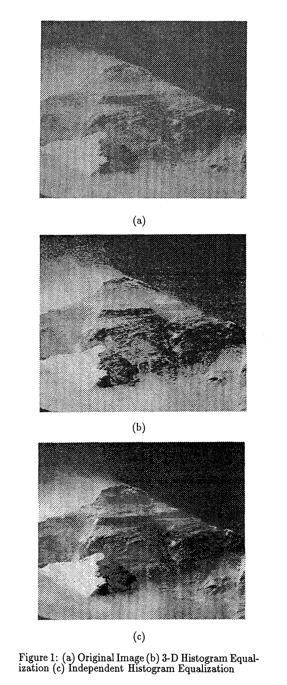
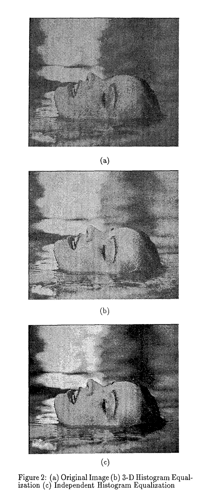

# 通过 3D 直方图均衡实现彩色图像增强

## 摘要

### 创新内容

在本文中，用于灰度级图像增强的直方图均衡方法扩展到彩色图像。提出了一种直接将 3-D 直方图均衡的方法，该方法可产生 RGB 值的统一直方图。

## 结论

这种方法已经被实验验证，当应用于高度相关的图像时，可以产生非常好的结果。

## 具体方法

### 3-D 直方图均衡

设三个随机连续变量 $R,G,B$(代表三个颜色分量)的联合概率密度函数为 $f_{R,G,B}(r,g,b)$ ，联合概率分布函数为 $F_{R,G,B}(r,g,b)=Prob(R\le r,G\le g,B\le b)$。与一维情况相同，我们将三个新变量定义为 $R',G',B'$ 满足
$$
\begin{equation}
\begin{array}{rcl}R'&=&F_R(R),\\G'&=&F_G(G),and\\B'&=&F_B(B)\end{array}
\end{equation}
$$
$R',G',B'$ 的联合分布函数为
$$
\begin{equation}
\begin{aligned}
&F_{R^{\prime},G^{\prime},B^{\prime}}(r',g',b') \\
&=Prob(R^{\prime}\leq r^{\prime},G^{\prime}\leq g^{\prime},B^{\prime}\leq b^{\prime}) \\
&=Prob(F_{R}(R)\leq r^{\prime},F_{G}(G)\leq g^{\prime},F_{B}(B)\leq b^{\prime}) \\
&=Prob(R\leq F_{R}^{-1}(r^{\prime}),G\leq F_{G}^{-1}(g^{\prime}),B\leq F_{B}^{-1}(b^{\prime}))\\
&=F_{R,G,B}(F_R^{-1}(r'),F_G^{-1}(g'),F_B^{-1}(b'))
\end{aligned}
\end{equation}
$$
假设 $R,G,B$ 互相独立，我们可以进一步将最后一个方程分解为三个颜色分量的概率分布函数的乘积：
$$
\begin{equation}
\begin{aligned}&F_{R^{\prime},G^{\prime},B^{\prime}}(r^{\prime},g^{\prime},b^{\prime})\\&=\quad F_{R}(F_{R}^{-1}(r^{\prime}))F_{G}(F_{G}^{-1}(g^{\prime}))F_{B}(F_{B}^{-1}(b^{\prime}))\\&=\quad r^{\prime}g^{\prime}b^{\prime}\end{aligned}
\end{equation}
$$

$$
\begin{equation}
\begin{array}{rcl}{f_{R^{\prime},G^{\prime},B^{\prime}}}&{=}&{\frac{\vartheta}{\vartheta r^{\prime}}\frac{\vartheta}{\vartheta g^{\prime}}\frac{\vartheta}{\vartheta b^{\prime}}F_{R^{\prime},G^{\prime},B^{\prime}}(r^{\prime},g^{\prime},b^{\prime})}\\&{=}&{1}\\\end{array}
\end{equation}
$$

设 $X$ 和 $Y$ 为输入和输出变量，其取值范围为 $x_{i_x}$ 和 $y_{i_y}$，其中 $i_x,i_y=0,\ldots,L-1$（$L$ 是离散灰度级的数量）相应的取值概率为 $p_X(x_{i_x})$ 和 $p_Y(y_{i_y})$。定义两个新变量
$$
\begin{equation}
C_{I_{x}}=\sum_{i_{x}=0}^{I_{x}}p_{X}(x_{i_{x}}), I_{x}=0,\ldots,L-1
\end{equation}
$$

$$
\begin{equation}
\overline{C}_{I_{y}}=\sum_{i_{y}=0}^{I_{y}}p_{Y}(y_{i_{y}}), I_{y}=0,\ldots,L-1
\end{equation}
$$

其中 $\overline{C}_{I_y}$ 的值是满足 $\overline{C}_{I_y}-C_{I_x}\ge 0$ 的 $I_y$ 的最小值。

设 $X$ 和 $Y$ 为输入和输出（向量）变量，假设取值三元组为 $(x_{r_x},x_{g_x},x_{b_x})$ 和 $(y_{r_y},y_{g_y},y_{b_y})$，其中 $r_x,g_x,b_x,r_y,g_y,b_y=0,\ldots,L-1$，其概率为 $p_X(x_{r_x},x_{g_x},x_{b_x})$ 和 $p_Y(y_{r_y},y_{g_y},y_{b_y})$。概率 $p_X$ 由原始彩色图像的直方图计算得到。概率 $p_Y$ 设置为 $\frac{1}{L^3}$，因为直方图有 $L^3$ 个条目，而且我们希望所有的条目概率相同（均匀分布）。$C_{R_xG_xB_x}$ 和 $\overline{C}_{R_yG_yB_y}$（公式 5 和 6 中 $C_{I_x}$ 和 $\overline{C}_{I_y}$ 的三维等价）由概率 $p_X$ 和 $p_Y$ 以下列公式方式计算：
$$
\begin{equation}
C_{R_{x}G_{x}B_{x}}=\sum_{r_{x}=0}^{R_{x}}\sum_{g_{x}=0}^{G_{x}}\sum_{b_{x}=0}^{B_{x}}p_{X}(x_{r_{x}},x_{g_{x}},x_{b_{x}})
\end{equation}
$$

$$
\begin{equation}
\begin{aligned}
\overline{C}_{R_{y}G_{y}B_{y}}& =\quad\sum_{r_{y}=0}^{R_{y}}\sum_{g_{y}=0}^{G_{y}}\sum_{b_{y}=0}^{B_{y}}p_{Y}(y_{r_{y}},y_{g_{y}},y_{b_{y}}) \\
&=\quad\sum_{r_{y}=0}^{R_{y}}\sum_{g_{y}=0}^{G_{y}}\sum_{b_{y}=0}^{B_{y}}\frac{1}{L^{3}} \\
&= \frac{(R_{y}+1)(G_{y}+1)(B_{y}+1)}{L^{3}}
\end{aligned}
\end{equation}
$$

公式 8 表明，$\overline{C}_{R_yG_yB_y}$ 只是计算了乘积，而非三次概率求和。由此，可以得到满足
$$
\begin{equation}
\overline{C}_{R_yG_yB_y}-C_{R_xG_xB_x}\ge 0
\end{equation}
$$
的最小 $R_y,G_y,B_y$。

### 计算考量

为简便起见，略去 $R_x,G_x,B_x$ 中任意一者为零的情况，则可以计算 $C_{R_xG_xB_x}$ 如下
$$
\begin{equation}
\begin{aligned}C_{R_{x}G_{x}B_{x}}&=C_{R_{x}-1,G_{x}-1,B_{x}-1}\\&+C_{R_{x}-1,G_{x}B_{x}}+C_{R_{x}G_{x}-1,B_{x}}+C_{R_{x}G_{x}B_{x}-1}\\&-C_{R_{x}-1,G_{x}-1,B_{x}}-C_{R_{x}-1,G_{x}B_{x}-1}-C_{R_{x}G_{x}-1,B_{x}-1}\\&+p_X(R_x,G_x,B_x)\end{aligned}
\end{equation}
$$

## 实验

### 实验结果

提出的彩色图像直方图均衡化方法已经在一组彩色图像上实现和测试。它还与在每种颜色中独立运行的直方图均衡化方法进行了实验比较。对这些方法性能的定量测量是很难得到的，因为这种方法性能的唯一标准（这也是所有图像增强方法的）是产生图像的视觉外观。这意味着只能进行大量的对比。我们的方法已经被验证可以产生清晰的图像，其颜色比独立直方图均衡化的情况更接近原始图像。这正如预期的那样，因为直方图沿对角线(灰线)方向拉伸，颜色不受影响。与我们的方法相比，以前的方法有过度拉伸直方图的倾向，导致图像不自然。三维直方图均衡化方法的一个重要特点是它几乎不“破坏”有（近似）均匀直方图的图像部分。这在其他队单独分量进行操作的方法中并不是必然的。这里给出两幅图像的结果以便于视觉观察。图 1b 展示了 3-D 直方图均衡化应用于图 1a 的“everest”图像的结果。在图 1c 中分别对三个分量应用了直方图均衡化。可以验证，直接三维直方图均衡化获得了更好的视觉结果。图 2 给出了一个“女孩”图像的相同结果。同种说明了通过三个分量的独立均衡从而过度拉伸直方图的效果。然而，我们的方法实现了增强图像，而没有产生任何颜色伪影。

