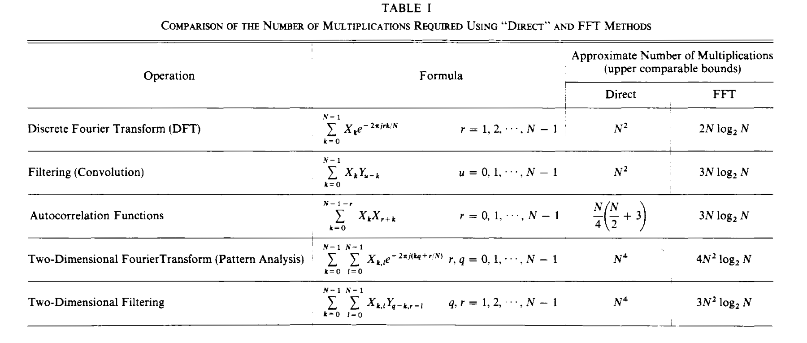
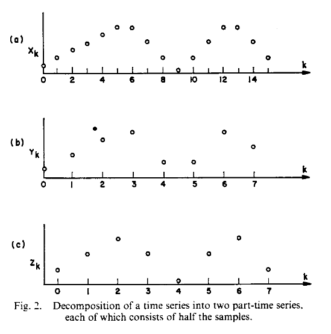

# 什么是快速傅里叶变换?

## 摘要

### 论文成果

本文定义了时间序列的离散傅里叶变换，并讨论了该变换的一些性质，导出了计算该变换的快速方法（快速傅里叶变换），并给出了这个方法的一些计算方面的内容。

## 离散傅里叶变换（DFT）

### DFT 及其逆变换的定义

DFT 定义为
$$
\begin{equation}
A_r=\sum_{k=0}^{N-1}X_k\exp(-2\pi jrk/N)\quad r=0,\cdots,N-1
\end{equation}
$$
其中 $A_r$ 是 DFT 的第 $r$ 个系数，$X_k$ 是由 $N$ 个样本组成的时间序列的第 $k$ 个样本，$j=\sqrt{-1}$。方便起见公式（1）常写为
$$
\begin{equation}
A_r=\sum_{k=0}^{N-1}(X_k)W^{rk}\quad r=0,\cdots,N-1
\end{equation}
$$
其中
$$
\begin{equation}
W=\exp(-2\pi j/N).
\end{equation}
$$
（2）的逆变换为
$$
\begin{equation}
X_l=(1/N)\sum_{r=0}^{N-1}A_rW^{-rl}\quad l=0,1,\ldots,N-1.
\end{equation}
$$
通过将（2）式插入（4）式，易证这种变换是有效的
$$
\begin{equation}
X_l=\sum_{r=0}^{N-1}\sum_{k=0}^{N-1}(X_k/N)W^{r(k-1)}.
\end{equation}
$$
将（5）式中的指标 $r$ 和 $k$ 求和的顺序交换，并利用正交关系
$$
\begin{equation}
\begin{aligned}
\sum_{r=0}^{N-1}\exp(2\pi j(n-m)r/N)&=N,\quad\text{if}\quad n\equiv m\mod N\\
&=0,\quad\text{otherwise}
\end{aligned}
\end{equation}
$$
这证明了（5）式的右边实际上等于 $X_l$。

将 $A_r$ 的定义范围扩展到所有整数（正数和负数）是有用的。在如下定义中，其遵循了这一点
$$
\begin{equation}
A_r=A_{N+r}=A_{2N+r}=\cdots.
\end{equation}
$$
类似地
$$
\begin{equation}
X_l=X_{N+l}=X_{2N+l}=\cdots.
\end{equation}
$$

### 快速傅里叶变换

#### FFT 的一般描述

FFT 是一种比其他可用算法更快地计算时间序列的 DFT。能够通过如此快的算法计算 DFT 使得 DFT 变得很重要。表 1 总结了通过使用 FFT 可能实现的经常被执行的计算的节省的比较。需要补充一点，在这里列出的计算工作量使用可比较上限，实际工作量取决于数字 $N$ 的大小和所应用的不同编程手段。

需要指出，FFT 不仅减少了计算时间；它还大幅减少了与这些计算有关的舍入误差。事实上，计算时间和舍入误差都以因子 $(log_2N)/N$ 降低，其中 $N$ 是时间序列的数据样本数。

FFT 是一种巧妙的计算技术，它按顺序组合逐渐增大的数据样本加权和，以产生公式 2 定义的 DFT 系数。该技术可以解释为组合单个数据样本的 DFT，以便按顺序考虑这些样本的出现时间，并应用于逐渐增大的互斥数据样本子组的 DFT，这些子组组合在一起最终产生完整数据样本的 DFT。本文中采用的 FFT 算法的解释特别适用于编程目的。

#### FFT 的通常形式

*时间抽样*：DFT【如式 2】和它的逆【如式 4】具有相同的形式，因此可以通过简单地交换 $X_k$ 和 $A_r$ 的角色，并使用适当的比例因子和符号更改来使得单个过程、及其或子例程能够用以计算二者。因此，FFT 的两种基本形式（及其修改）是等价的。但是，值得区分它们并单独讨论它们。让我们首先考虑 Cooley 和 Tukey 使用的形式，它应该被称为*时间抽样*。反转 $A_r$ 和 $X_k$ 的角色，得到成为*频率抽取*的形式，这将被稍后考虑。

假设具有 $N$ 个样本的时间序列【例如图 2(a) 中所示的 $X_k$】被分成两个函数，$Y_k$ 和 $Z_k$，每个函数只有一半数目的点 $(N/2)$。函数 $Y_k$ 由偶数点 $(X_0,X_2,X_4,\cdots)$ 组成，$Z_k$ 由奇数点 $(X_1,X_3,X_5,\cdots)$ 组成。这些函数如图 $2(b)$ 和 $2(c)$ 所示，我们可以形式化写成

$$
\begin{equation}
\begin{aligned}&Y_{k}=X_{2k}\\&&k=0,1,2,\cdots,\frac{N}{2}-1.\\&Z_{k}=X_{2k+1}\end{aligned}
\end{equation}
$$
因为 $Y_k$ 和 $Z_k$ 都是由 $N/2$ 个点组成的序列，它们由如下定义的离散傅里叶变换
$$
\begin{equation}
\begin{aligned}&B_{r}=\sum_{k=0}^{(N/2)-1}Y_{k}\exp{(-4\pi jrk/N)}\\&&r=0,1,2,\cdots,\frac{N}{2}-1.\\&C_{r}=\sum_{k=0}^{(N/2)-1}Z_{k}\exp{(-4\pi jrk/N)}\end{aligned}
\end{equation}
$$
我们想要的离散傅里叶变换是 $A_r$，我们可以用奇数点和偶数点来定义
$$
\begin{equation}
    \begin{aligned}A_{r}&=\sum_{k=0}^{(N/2)-1}\left\{Y_{k}\exp{(-4\pi jrk/N)}+ Z_{k}\exp\left(-\frac{2\pi jr}{N}[2k+1]\right)\right\}\\&r=0,1,2,\cdots,N-1\end{aligned}
\end{equation}
$$
或
$$
\begin{equation}
    \begin{aligned}A_{r}&=\sum_{k=0}^{(N/2)-1}Y_k\exp{(-4\pi jrk/N)}+\exp{(-2\pi jr/N)}\sum_{k=0}^{(N/2)-1}Z_k\exp{(-4\pi jrk/N)}\end{aligned}
\end{equation}
$$
使用公式 10，可将上式写成如下形式
$$
\begin{equation}
A_r=B_r+\exp(-2\pi jr/N)C_r\quad 0\le r<N/2.
\end{equation}
$$
对于 $r$ 大于 $N/2$ 的情况，离散傅里叶变换 $B_r$ 和 $C_r$ 将会周期性重复 $r<N/2$ 对应的值。因此，将 $r+N/2$ 代入公式 13 的 $r$，我们得到
$$
\begin{equation}
    \begin{aligned}
A_{r+N/2}& = B_{r} + \exp \left(- 2\pi j\biggl[r + \frac{N}{2}\biggr]/N\right)C_{r}
&0\le r<N/2 \\
&=B_r-\exp{(-2\pi jr/N)}C_r&0\le r<N/2.
\end{aligned}
\end{equation}
$$
 通过公式 3, 13 和 14 我们有
$$
\begin{equation}
    A_r=B_r+\cdot W^rC_r\quad0\leq r<N/2
\end{equation}
$$

$$
\begin{equation}
    A_{r+N/2}=B_{r}-W^{r}C_{r}\quad0\leq r<N/2.
\end{equation}
$$

从公式 15 和 16 可以看出，$X_k$（具有 $N$ 个样本的序列）的离散傅里叶变换的前 $N/2$ 个点和后 $N/2$ 个点可以简单地从 $Y_k$ 和 $Z_k$ 的 DFT 中得到，这两者都是有 $N/2$ 个样本的序列。

假设我们有一个方法，可以在与样本数的平方成比例的时间内计算离散的傅里叶变换，我们可以使用这个算法来计算 $Y_k$ 和 $Z_k$ 的变换，这就需要与 $2(N/2)^2$ 成比例的时间，而后使用公式 15 和 16 来用额外的 $N$ 次操作来计算 $A_r$。

然而，由于 $Y_k$ 和 $Z_k$ 将被转换，并且我们已经证明了 $N$ 个样本的 DFT 的计算可以简化为计算两个有 $N/2$ 个样本的 DFT，而 $B_k$（或 $C_k$）的计算可以进一步被减少为计算有 $N/4$ 个样本的序列。只要每个函数都有可被 2 整除的样本数，就可以执行这些缩减。因此，若 $N=2^n$，则我们可以进行这样的缩减，首先对 $N$ 应用公式 9, 15 和 16，然而对 $N/2$…，最后用于两个点的函数。当然，单点函数的离散傅里叶变换是样本本身。

当 $N$ 不是 2 的幂，但其具有因子 $p$ 时，可以通过形成 $p$ 个不同的序列 $Y_k^{(i)}=X_{pk+i}$ 来开展类似于公式 9 到 13 的过程。每个序列都有一个 DFT $B_r^{(i)}$，并且序列 $X_k$ 可以通过 $pN$ 个复数乘法和加法从 $p$ 个更简单的 DFT 中计算出来。即
$$
\begin{equation}
    \begin{gathered}
A_{r+m(N/p)}=\sum_{i=0}^{p-1}B_{r}^{(i)}W^{i[r+m(N/p)]} \\
m=0,1,2,\cdots,p-1 \\
r=0,1,2,\cdots,\frac{N}{n}-1. 
\end{gathered}
\end{equation}
$$
如果 $N$ 有额外的质因数，则可以进一步简化 DFT 的计算。

*频率抽样*：现在让我们考虑快速傅里叶变换算法的第二种非常不同的形式，即*频率抽样*。这种形式是由 Sande 以及 Cooley 和 Stockham 独立发现的。令时间序列 $X_k$ 有 DFT $A_r$。时间序列和 DFT 都包含 $N$ 项。和之前一样，我们将 $X_k$ 分成两个有 $N/2$ 个点的序列。但是，第一个序列 $Y_k$ 现在由 $X_k$ 的前 $N/2$ 个点构成，第二个序列 $Z_k$ 由 $X_k$ 的后 $N/2$ 个点构成。正式地讲：
$$
\begin{equation}
    \begin{aligned}&Y_{k}=X_{k}\\&&k=0,1,2,\cdots,\frac{N}{2}-1.\\&Z_{k}=X_{k+N/2}\end{aligned}
\end{equation}
$$
$X_k$ 的含 $N$ 个点的 DFT 现在可以用 $Y_k$ 和 $Z_k$ 表达
$$
\begin{equation}
    \begin{aligned}A_{r}&=\sum_{k=0}^{(N/2)-1}\left\{Y_{k}\exp{(-2\pi jrk/N)}+Z_{k}\exp\left(-2\pi jr\left[k+\frac{N}{2}\right]/N\right)\right\}\end{aligned}
\end{equation}
$$

$$
\begin{equation}
    A_r=\sum_{k=0}^{(N/2)-1}\{Y_k+[\exp(-\pi jr)]Z_k\}\exp{(-2\pi jrk/N)}.
\end{equation}
$$

让我们分别考虑转换的偶数点和奇数点。设偶数点为 $R_r$，奇数点为 $S_r$，其中
$$
\begin{equation}
    \begin{aligned}&R_{r}=A_{2r}\\&&0\leq r<N/2.\\&S_{r}=A_{2r+1}\end{aligned}
\end{equation}
$$
正是这一步称为*频率抽样*。注意当计算偶数频谱点的时候，公式 20 就是
$$
\begin{equation}
    R_r=A_{2r}=\sum_{k=0}^{(N/2)-1}\{Y_k+Z_k\}e^{(-2\pi jrk)/(N/2)}
\end{equation}
$$
我们将其识别为具有 $N/2$ 个点的函数 $Y_k+Z_k$ 的 DFT。类似地，对于技术频谱点，公式 20 就是 
$$
\begin{equation}
    \begin{aligned}S_{r}=A_{2r+1}&=\sum_{k=0}^{(N/2)-1}\{Y_{k}+Z_{k}\exp{(-\pi j[2r+1])}\}\cdot\exp(-2\pi j[2r+1]k/N)\\&=\sum_{k=0}^{(N/2)-1}\{Y_{k}-Z_{k}\}e^{(-2\pi jk)/N}e^{[(-2\pi jrk)/(N/2)]}\end{aligned}
\end{equation}
$$
我们将其识别为具有 $N/2$ 个点的函数 $(Y_k-Z_k)\exp(-2\pi jk/N)$ 的 DFT。

对于从公式 22 和 23 可以得出结论，一个 $N$ 样本序列 $X_k$ 的 DFT 可以如下确定。对于偶数变换点，它可以计算为 $X_k$ 的前 $N/2$ 和后 $N/2$ 个样本的简单组合的 $N/2$ 点 DFT。对于奇数变换点，它可以计算为 $x$ 的前后 $N/2$ 样本的不同简单组合的另一个 $N/2$ 点 DFT。

为了实现 “就地” 计算，我们必须处理位反转，而要消除位反转，我们必须放弃 “就地” 计算。使用同质存储设施时，最有效的两种方法是按正确的顺序提供计算中所需的正弦和余弦系数。其他方法似乎不太理想，因为它们浪费表格。

*有用的计算变量*：可以指出的是，当因子 $p$ 和 $q=N/p$ 互质的时候，可以实现一些编程的简化。正如 Cooley, Lewis 和 Welch 所描述的，可以通过选择与以前使用的 $X_k$ 不同的子序列来消除“旋转因子” $W$。然后，DFT 计算可以方便地分两个阶段执行。

1）计算 $q$ 点转换
$$
\begin{equation}
    B_{r}^{(i)}=\sum\limits_{k=0}^{q-1}Y_{k}^{(i)}\cdot W^{pkr}\quad\begin{array}{c}i=0,1,\cdots,p-1\\r=0,1,\cdots,q-1\end{array}
\end{equation}
$$
对于每一个 $p$ 序列
$$
\begin{equation}
    Y_{k}^{(i)}=X_{pk+qi}\quad\begin{array}{c}i=0,1,\cdots,p-1\\k=0,1,\cdots,q-1.\end{array}
\end{equation}
$$
2）计算 $q$ 点序列 $B_r^{(i)}$ 的 $p$ 点转换
$$
\begin{equation}
A_s=\sum_{i=0}^{p-1}B_r^{(i)}\cdot W^{qim}
\end{equation}
$$
其中
$$
s=r\cdot p(p)_q^{-1}+m\cdot q(q)_p^{-1}\qquad (\text{mod }N,0\le s<N)
$$
记号 $(p)_q^{-1}$ 是 $p$ 在模 $q$ 下的倒数，即 $p(p)_q^{-1}>1\text{ }(\text{mod }q)$ 的解。
